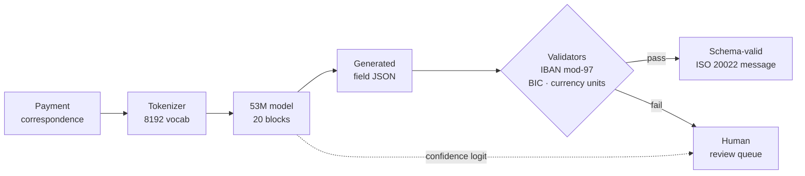
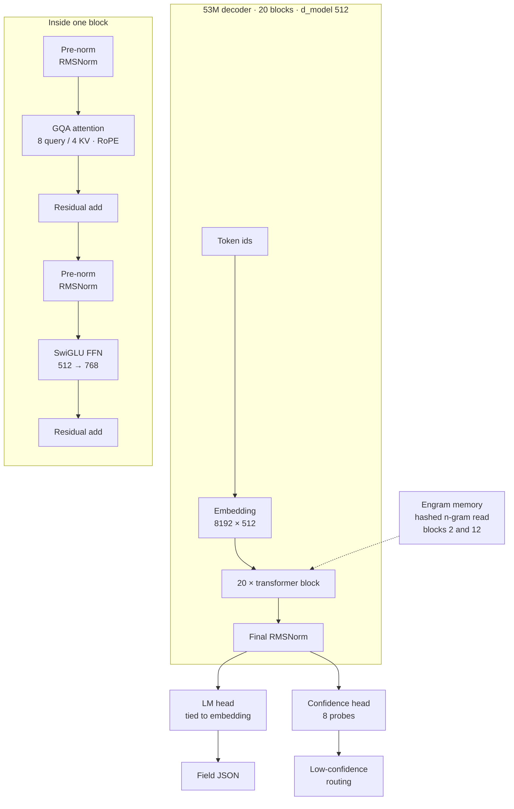

# ISO 20022 extraction lab

A 53M-parameter model that reads unstructured payment correspondence and emits
schema-valid ISO 20022 fields. It trains from scratch on a single consumer GPU.
No frontier model, no API call, and no document leaving the machine.

The structural pipeline is complete and verified: **six of the nine acceptance
checks pass at 100%**, including valid JSON, canonical field names, deterministic
decoding, schema-valid message assembly, and field-level routing agreement.
Value accuracy on unseen values is the remaining work, and it is a training-scale
problem rather than an open question.

Getting this far required finding four separate ways the metrics were lying, all
of them in the model's favour. Two of those are documented in
[`PROOF-OF-CONCEPT-STORY.md`](PROOF-OF-CONCEPT-STORY.md); the rest are in the
build log.

---

## Where the model sits



The dotted edge is the part worth noticing. Confidence is a second output of
the same forward pass, so an uncertain document becomes a routing decision
rather than an error.

---

## The interesting part

The training log reported 100% field recall while the checkpoints it wrote
generated repetition loops. The weights were not the problem. All 214 tensors
round-tripped byte for byte, so the checkpoint was faithful.

`RotaryEmbedding` held its inverse frequencies in a buffer marked
`persistent=False`. They were never written to the file, and the loader left them
uninitialised:

```text
trained    [1.0, 0.6978, 0.4869, 0.3398]
reloaded   [-9.65e-11, 3.09e-41, 0.0, 0.0]
```

Rebuilding them from `head_dim` and `theta` made the two forward passes agree
exactly, with no residual difference in the logits. Three further faults were
hiding behind that one, each of which also made the model look better than it
was:

| Fault | Symptom | Fix |
| --- | --- | --- |
| Uninitialised RoPE buffer | Log and artifact disagreed by 287× in loss | Rebuild `inv_freq` in `_init_weights` |
| Teacher-forced metric | 100% recall on a model producing loops | Score generation, not next-token |
| Validation leakage | 600/600 validation answers present in training | Disjoint held-out draw |
| Difficulty-major sampling | Gate saw one difficulty level | Shuffle across levels |

Each was found by measuring one quantity two ways and refusing to accept that
the answers disagreed. That is the whole method, and it is why
[`test_metric_describes_artifact.py`](iso20022-lab/test_metric_describes_artifact.py)
exists as a test rather than a one-off investigation.

---

## Architecture

| Component | Value |
| --- | --- |
| Parameters | 52,982,805 (53.0M) |
| Layers | 20 |
| Model width | 512 |
| Attention | 8 query / 4 KV heads (grouped-query) |
| FFN | SwiGLU, hidden 768 |
| Positions | RoPE, theta 100000 |
| Norm | Pre-norm RMSNorm |
| Vocabulary | 8192, trained on this domain |
| Context | 256 tokens |
| Engram memory | 2 layers (2, 12), 8192 slots × 128 dim × 2 heads |
| Confidence head | 8 probes |



Each block is pre-norm with two residual adds, and the engram is a memory read
injected into blocks 2 and 12 rather than extra attention positions.

**Engram.** Token n-grams are hashed into a table of learnable vectors, fetched,
and content-addressed against the current hidden state. It is a memory read added
as a residual before attention, not extra attention positions. Payment documents
are dense in short repeated n-grams — currency codes, BIC shapes, IBAN country
prefixes, XML element names — so recall of exactly those patterns is worth more
here than at general language scale.

**Confidence head.** Pools hidden states through learned probes into one
correctness logit per document. Trained in a second stage on the model's own
right and wrong outcomes, not on ground truth, because on ground truth every
label is "correct" and the head learns a constant. Use it to route low-confidence
documents to review.

---

## Acceptance gate

Nine checks, run against a fresh document draw that the model has never seen.
The gate is the deliverable: a specialist model is only usable to the extent you
can trust the number describing it.

| Check | Result | Threshold |
| --- | --- | --- |
| C1 valid JSON object | **1.0000** | 1.0 |
| C2 canonical keys only | **1.0000** | 1.0 |
| C3 no duplicate keys | **1.0000** | 1.0 |
| C6 deterministic | **1.0000** | 1.0 |
| C7 XSD round-trip | **1.0000** | 1.0 |
| C9 routing agreement | **1.0000** | 1.0 |
| C4 values grounded | 0.0000 | 1.0 |
| C5 field accuracy | 0.7167 | ≥ 0.9 |
| C5b document STP | 0.0000 | ≥ 0.5 |
| C8 role consistency | 0.0000 | 1.0 |

The four that do not pass all reduce to the same cause: value accuracy on unseen
values. The distinct-value count in the corpus is a parameter, not a redesign,
which is what makes this the tractable kind of remaining work.

---

## Quickstart

```bash
git clone --recurse-submodules https://github.com/siva-sub/iso20022-extract
cd iso20022-extract
python -m venv .venv && source .venv/bin/activate
pip install -e "./iso20022-lab[dev,train]"
```

`--recurse-submodules` matters: `iso20022-lab/schemas/` is a 131 MB submodule of
ISO 20022 XSDs, used for schema introspection and round-trip validation.

Run the tests:

```bash
cd iso20022-lab
pytest -q
```

Generate a corpus and run the gate:

```bash
python -m iso20022_lab.corpus --seed 7 --values 4000 --out data/corpus
python -m iso20022_lab.acceptance --checkpoint data/model/final --holdout data/holdout
```

Teacher-forced distillation needs a teacher endpoint; copy `.env.example` to
`.env` and fill it in. Runnable field-level instructions are in
[`iso20022-lab/RECIPES.md`](iso20022-lab/RECIPES.md).

---

## Layout

```text
iso20022-lab/
  src/iso20022_lab/
    model/       transformer, tokenizer, two-stage training, HF export
    corpus.py    generator: three difficulty levels, validator-checked values
    synth.py     document rendering
    validators.py  IBAN mod-97, ISO 9362 BIC, currency minor units
    acceptance.py  the nine-check gate
    routing.py   IBAN↔BIC country cross-check
    economics.py exception economics for the review queue
  test_*.py      including test_metric_describes_artifact.py
  schemas/       ISO 20022 XSDs (git submodule)
```

The Python package is `iso20022_lab`; the repository is `iso20022-extract`.

---

## Model checkpoint

Weights are on Hugging Face, not here — 202 MB per checkpoint and 3.2 GB across
all of them.

- **Model:** [`sivasub987/iso20022-extract-53m`](https://huggingface.co/sivasub987/iso20022-extract-53m)

```python
from transformers import AutoModelForCausalLM, AutoTokenizer

model = AutoModelForCausalLM.from_pretrained(
    "sivasub987/iso20022-extract-53m", trust_remote_code=True
)
tok = AutoTokenizer.from_pretrained("sivasub987/iso20022-extract-53m")
```

---

## Where this fits, and what it is worth

### The workflow position

In a payment operation the extractor sits between capture and validation. A
document arrives by one of several channels, its fields are lifted into a
canonical key space, and a validator decides whether it can be released or must
be queued. Everything downstream is already deterministic. This is the one step
that has been human because the input is unstructured.

The reason to care is the shape of payment economics: enormous volume, thin
per-item margin, and a standard measure called straight-through processing. Every
point of STP lost converts directly into manual work, and manual work is where
the margin goes.

### "Why not just write regexes?"

This is the right first question, and it has a measured answer rather than a
sales answer. Two competent rule engines were built — label-anchored extraction,
a normaliser per format, pattern fallbacks, and deterministic validators — and
scored on the same 360 documents.

| Extractor | STP | Field accuracy | XSD pass |
| --- | --- | --- | --- |
| `rules_v1` (one template) | 33.3% | 47.1% | 33.3% |
| `rules_v2` (every synonym) | 51.7% | 89.4% | 100.0% |

By difficulty, which is where the finding lives:

| Extractor | clean | messy | hostile |
| --- | --- | --- | --- |
| `rules_v1` | **100.0%** | 0.0% | 0.0% |
| `rules_v2` | 92.5% | 62.5% | **0.0%** |

**`rules_v1` scores 100% on `clean` and exactly 0% on everything else.** Not 80%,
not 60% — zero. A rules engine does not fail gradually. It succeeds completely
inside the format it was written for and fails completely outside it.

The consequence is that a rules engine does not have an accuracy. It has a
**coverage**, and coverage is counted in formats. The cost of the rules approach
is therefore not a percentage of documents. It is **one rule set per document
format**, and the number of formats is a property of your customer base, not
your volume.

That gives a real decision procedure rather than a slogan:

| Your situation | The right answer |
| --- | --- |
| One format, high volume, stable | Regex. Buying a model is waste. |
| A handful of formats | Regex, plus normalisers per format |
| Many formats, or formats you do not control | The rule maintenance exceeds the model |
| Onboarding a new customer | Model: zero engineering. Rules: days, per customer |

For a shop with three formats, regex wins outright. The claim here is not that
models beat rules. It is that rules cost scales with format count while model
cost is fixed, and that the crossover is a business input rather than a
technical one.

### What rules structurally cannot do

The step function is a cost argument. There is also a capability argument, and it
is the honest reason a rule engine plateaus.

Given `Account: DE89370400440532013000`, a rule engine knows the value is an
IBAN. It cannot know whether that account is the payer's or the beneficiary's,
because that fact lives in the document's *meaning* and not in its surface form.
When the label is missing, the pattern fallback has to guess by position, and it
is wrong roughly half the time.

That single limitation is what the exception rate is made of. In the measured
recognition-tax run, damage attributed by cause came out as:

```text
  role      73   a real value from this document put in the wrong field
  missing  877   nothing extracted; incomplete, so review sees it
  caught   193   characters changed and a validator rejects it
  silent     9   characters changed and nothing rejects it
```

The `silent` row is the dangerous one, and it is small here because validators
catch most corruption. The `role` row is the one a bigger rule set does not fix.

### The economics

Exceptions are where the money is, so price them. At 100,000 messages/month, 8
minutes per exception, and $45/hour loaded:

| STP | Exceptions/month | Annual cost | FTE |
| --- | --- | --- | --- |
| 85.1% | 14,925 | $1.07M | 13.1 |
| 64.2% | 35,821 | $2.58M | 31.4 |
| 49.8% | 50,249 | **$3.62M** | 44.1 |

**One STP point is worth $72,000/year** at this volume. The sensitivity to the two
soft inputs, at the measured 49.8%:

| min/exception | $25/h | $35/h | $45/h | $65/h | $90/h |
| --- | --- | --- | --- | --- | --- |
| 2 min | 0.5M | 0.7M | 0.9M | 1.3M | 1.8M |
| 8 min | 2.0M | 2.8M | 3.6M | 5.2M | 7.2M |
| 30 min | 7.5M | 10.6M | 13.6M | 19.6M | 27.1M |

**And this is where the usual framing goes wrong.** The obvious question is
whether to run inference on an API or locally, and that question is worth:

```text
  infrastructure delta at 100k/month   $56,000/year
  STP delta, 49.8% -> 85%              $2,537,910/year
```

The STP difference is worth **45.3× the infrastructure difference**. The entire
$20k build is repaid by **0.33 of one STP point**. Where inference runs is a
rounding error next to how often the pipeline is right.

Which reframes the local-versus-cloud argument entirely. Local wins here for
data residency, determinism, and auditability. It does not win on cost, because
cost was never the deciding term.

### The honest position today

This model does not yet beat the rule baseline. `rules_v2` reaches 51.7% document
STP; this model is at 0% against a 50% target, with 71.7% field accuracy against
90%. On the measured evidence, a competent rule engine is the better buy today,
and saying otherwise would be the kind of claim this project exists to catch.

What the work establishes is the other half of the decision. The rules path
plateaus at the number of formats you have written, role ambiguity is not
solvable by more patterns, and the money is concentrated in STP rather than in
infrastructure. A model that reaches the gate converts all three of those into a
fixed cost rather than a per-format one.

### What would make this decision

The gap is value accuracy on unseen values, and the lever is the distinct-value
count in the corpus, which is a parameter rather than a redesign. The specific
next experiment: raise the distinct value-sets until memorisation stops being an
option, and measure whether field accuracy crosses 90% with document STP above
50%. If it does, the comparison against `rules_v2` is worth running properly. If
it plateaus well below on a corpus this clean, that is a real negative result
and worth publishing as one.

## Where this goes

The narrow case is a document type with a fixed field set, a validator for every
field, and a human who can absorb the low-confidence queue. Payment extraction
fits, and so do trade confirmations, KYC packets, and reconciliation breaks.

Three properties make the local version worth building before accuracy reaches
target. The confidence head turns an uncertain extraction into a routing decision
instead of an error. Deterministic decoding makes the same document produce the
same output, which is what an audit needs. And the routing cross-check resolves
two fields against each other, so an IBAN that disagrees with its bank's country
code is caught without consulting anything external.

---

## Limitations

Synthetic prose is easier than what arrives in a real payment operations inbox.
Field accuracy is 71.7% on a fresh draw against a 90% target, and document
straight-through is 0% against 50%. One model has been trained against one
generator. The list of metric faults was found in sequence rather than by audit,
so there is no reason to think it is complete. Nothing here has been tested on
live payment traffic.

Do not use this to move money.

---

## License

Apache-2.0. See [`LICENSE`](LICENSE).

The ISO 20022 XSDs in `iso20022-lab/schemas/` are a separate upstream repository
([`EggBaconAndSpam/iso20022-schemas`](https://github.com/EggBaconAndSpam/iso20022-schemas))
tracked as a submodule, with its own terms.

The architecture follows Needle (Cactus Compute, 45M). This model is 53M, with
grouped-query attention and a hashed n-gram memory, ported to PyTorch so it loads
through `transformers`.
